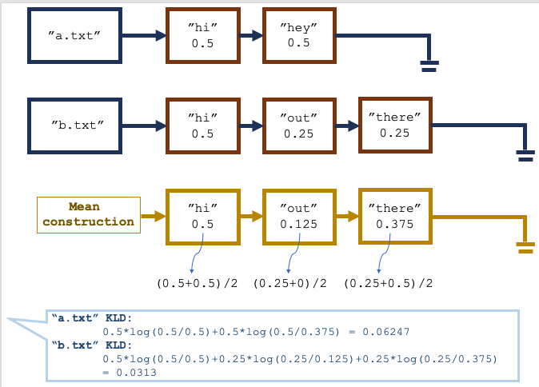

# File Analysis
This is Assignment2 of CS 214:System Programming, Fall 2020
Completed by Hsinghui Ku & Chang Li

## Description
In this program, we use the filesystem API and the POSIX thread library to
implement a simple plagiarism checker. 

This program will scan through all files and subdiretories starting from a given base directory, and it will start a new thread handling each file or subdirectory. A file will be handled by reading in its contents and building a discrete distribution of all the words that appear in it. After processing all the files, this program will compare the distrbution, output the result based on the order of total tokens in the files.

### Directory Handling
Directory-handling function will check the directory to see if it is accessible. If it is not, it
will output an error and return. If it is accessible, it will open the directory with
opendir() and iterate through its contents with readdir(). Whenver is finds a directory it will create a
new pthread running another copy of the directory handler; Whenver is finds a file it should create a new pthread running another copy of the file hander. 

### File Handling
File-handling function will update a shared datastructure representing the frequency of all tokens
in all files as it scans through the file it has been given. It will first check if the file is accessible. If not, it will print an error message and return. If it can access it, it will lock the synchronization mechanism it was given, add an entry in the shared data structure it was given holding the file's path/name and total number of tokens scanned, unlock the synchronization mechanism and then start tokenizing the file. It will d divide each token amount by the total number of tokens found, computing the discrete
probability of each, and also sort its token list alphabetically.

### Analysis
This program will compute the Jensen-Shannon Distance using following equation:
\
KLD(First∣∣Mean)=∑ First(x)∗log(First(x)/Mean(x))
\
KLD(Second∣∣Mean)=∑Second (x)∗log(Second (x)/Mean(x))
\
JSD = (KLD(First)+ KLD(Second)) / 2;

